------------------------------------------------------------------------

## Introduction

College Athletics in America is a multi-billion-dollar enterprise and is a crucial step in developing elite athletes. Mainly governed by the National Collegiate Athletics Association (NCAA), college sports not only generates revenue, but acts as a pathway for future Olympians, professional, and world-class athletes. Because of the NCAAs global impact on athletics, looking at the rules and trends in this part of sports can provide information on what helps athletes become the most successful in their sport.

An enormous part of the NCAA is for a player's ability to transfer, or when the player decides to change what institution they attend and play for. This concept is not seen in many professional levels, and allows for the player to find the best fit academically, athletically, or personally. Transferring rules have changed drastically within the last decade. A simple timeline goes as follows ([Cole et al. (2026)](https://doi.org/10.51221/sc.jiia.2026.19.1.15), [Yurko (2025)](https://www.youtube.com/watch?v=SdXpknMhGBc)):

-   2018 - **launch of NCAA Transfer Portal** *"student athlete database compliance tool"*

-   2020 - COVID-19 begins to impact college sports

-   2021 - Student athletes allowed to **transfer once without sitting out a year** & **Name, Image, & Likeness (NIL)** era begins

-   2024 - **Immediate eligibility no matter how many times athletes transferred**

Due to these new rules, the number of athletes transferring increases each year. This new trend allows for new analysis of college sports.

](images/NCAA_transfer_numbers.png){#fig-transfer-numbers}

An academic paper that provided a moderate framework for our research was [Cole et al. (2026)](https://doi.org/10.51221/sc.jiia.2026.19.1.15), titled *Big Fish or Little Pond? National Evidence on the Relationship Between Transferring and Athletic Performance Within Division I Men's College Basketball*. In this paper, player categories that could go unnoticed were highlighted and used as predictors. This included indicating if a player was an overperformer/underperformer and the size of program before and after the transfer. The big fish little pond effect was frequently referenced throughout the research process.

Transferring has a huge impact on coaches, players, and programs as a whole. It allows for easier and quicker access for athletes to find a better fit, coaches to find a missing piece to their roster, and athletic departments to attract new talent to boost their reputation. The effects of transferring could be endless. One of these effects impacts all three entities - players, coaches, and schools. What is the effect of transferring on a player's performance?

## Data

For this particular research question, it was decided to analyze one specific sport in the NCAA. When choosing what sport, the availability of data, amount of data, popularity, and interpretability of sport were all considered. This led us to men's basketball, specifically at the divison I level. This is because men's basketball, in the NCAA, is ranked second in all of the following metrics:

-   number of games in a season (2nd to women's softball)

-   revenue generated (2nd to football)

-   overall popularity (also 2nd to football)

When it comes to the data used in our research, we used the `hoopR` R package part of the **SportsDataverse** ecosystem [(Gilani, 2026)](https://github.com/sportsdataverse/hoopR). Within this dataset, each observation is a player's season and their metrics for that season. This data source is also publicly available, making our code entirely reproducible (see the [Contact Information and Code Availability](#contact) section).

](hoopR_logo.png){#fig-hoopr-logo fig-align="center" width="186"}

A simplified example of what the overall structures of these datasets look like:

|  Player   | Year |  Team  | PPG  | Experience | Conference |
|:---------:|:----:|:------:|:----:|:------------:|:----------:|
| J. Broome | 2025 | Auburn | 18.6 | Super Senior | SEC | 
| L. Garza  | 2021 |  Iowa  | 24.1 | Senior | B10 |
|  Z. Edey  | 2023 | Purdue | 22.3 | Junior | B10 |
|  Z. Edey  | 2024 | Purdue | 25.2 | Senior | B10 |
| C. Flagg  | 2025 |  Duke  | 19.2 | Freshman | ACC |

: Original Data of NCAA Division I Men's Basketball Player Statistics by Season from hoopR Package (2022-23 to 2025-26) {#tbl-original-data}

The data used only contains player demographics and metrics from seasons 2021-2026 (season is the year the championship for that season was played). This is because these seasons occur after the NIL and immediate eligibility after transfer ruling, which caused the first major spike in players transferring.

Regarding creating new features, only one main column was constructed. This variable is called changed team and is the $Transferred$ indicator, showing if a row is/is not a year playing for a new school.

So, columns indicating a if the player is a transfer for a certain year, if they have transferred before, and how many times they have transferred were added for insight on a player's career path. Along with this, features on a player's previous years metrics were used to see a difference in player's performance between years. A simplified example of what the overall structures of the datasets after adding these columns looks like:

| Player | Year | Team | PPG | Experience | Conference | Team Rating | Conference Rating | Transferred |
|:------------:|:----:|:---------------:|:---:|:------------:|:------------:|:-----------:|:------:|:------:|:------:|
| H. Dickinson | 2022 | Michigan | 18.6 | Sophomore | B10 | 0.874 | 0.804 | FALSE |
| H. Dickinson | 2023 | Michigan | 17.8 | Junior | B10 | 0.832 | 0.811 | FALSE |
| H. Dickinson | 2024 | Kansas | 17.9 | Senior | B12 | 0.8976 | 0.838 | TRUE |
| H. Dickinson | 2025 | Kansas | 16.4 | Super Senior | B12 | 0.921 | 0.855 | FALSE |
| C. Love | 2022 | North Carolina | 16.1 | Sophomore | ACC | 0.911 | 0.754 | FALSE |
| C. Love | 2023 | North Carolina | 16.7 | Junior | ACC | 0.843 | 0.692 | FALSE |
| C. Love | 2024 | Arizona | 17.4 | Senior | B12 | 0.950 | 0.763 | TRUE |
| C. Love | 2025 | Arizona | 18.0 | Super Senior | B12 | 0.946 | 0.855 | FALSE |

: Preprocessed Dataset of Player Statistics for EDA and Modeling {#tbl-cleaned}

## Exploratory Data Analysis {#exploratory-data-analysis}

**a) If a player is already performing well, they should not transfer**

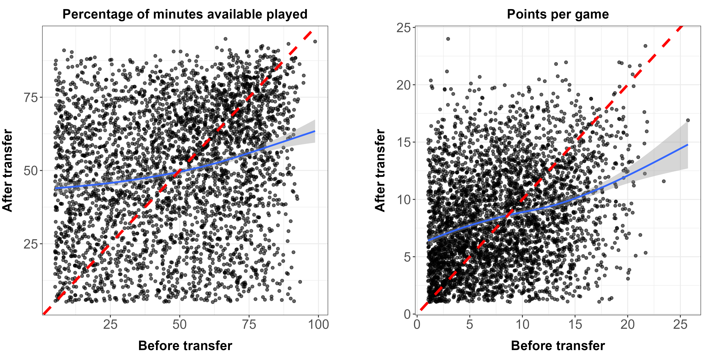{#fig-min-ppg}

Aspects of this graph:

-   Line y = x is the "line of equal return"

-   Trend line is the smoothed overall performance trend

-   Points only filtered to the top 90% of the data, so that players who get zero minutes or points don't affect the graph

On both plots, the trend line starts above y = x, but then intersects the line of equal return, and remains under that line for the rest of the plot. This shows that if a players points per game/percentage of minutes available played (PPG/Min%) the previous year is below the PPG/Min% at the point of intersection, the average player will have a higher PPG/Min% after their transfer than before their transfer. Reversely, if a player has a higher PPG/Min% in their previous year than the point of intersection, then the average player will have a lower PPG/Min% after their transfer than before their transfer. More simply, the better a player is, the harder it will be to match or surpass their previous PPG/Min% after a transfer. So, if a player is playing well, it is not advised to transfer.

**b) Average points per game generally improves over players’ careers, but transfers typically outperform non-transfers**

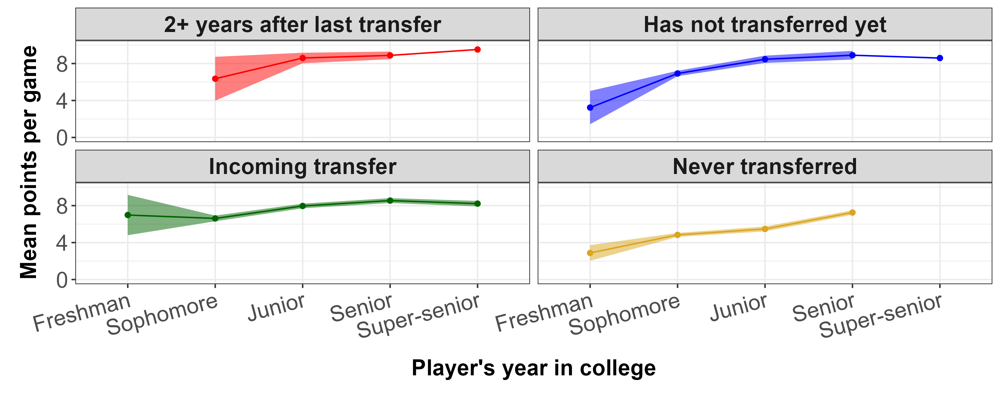{#fig-age-curve}

Aspects of this graph:

-   X-axis is the category of experience or eligibility in the NCAA

-   Y-axis is a the average points per game for the category

-   Color is the transfer status of the players in each category

From this, the pattern trend is that each line, for the most part, increases year over year. This accurately reflects the phenomenon where many players within the NCAA improve their performance when they gain more experience. This is similar to the relationship between performance and age in the NBA. However, age curves in the NBA display a peak at a certain age. In the NCAA, performance increases with experience, as most players hit a peak later in their career after their time in collegiate athletics. Another major trend in the graph is the never transferred line is somewhat lower than the lines that indicate a player has transferred or will transfer at least once. This inspired deep analysis on the difference in metrics between non-transfers and transfer athletes.

**c) Positions with the most transfers**

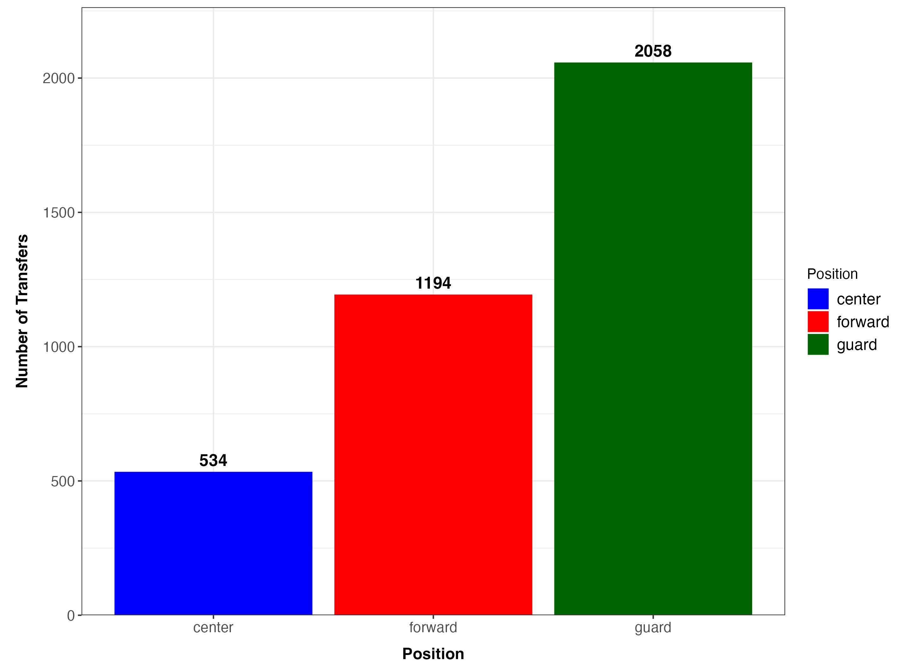{#fig-transfer-position}

This figure helps to gauge what position in basketball is transferring the most often. It shows us that players who play guard transfer the most often. While it is not known as to why that is the case, but finding the underlying trends in the type of players that make up the players in the portal is very important in our research.

**d) Experience/Class Level with the most transfers**

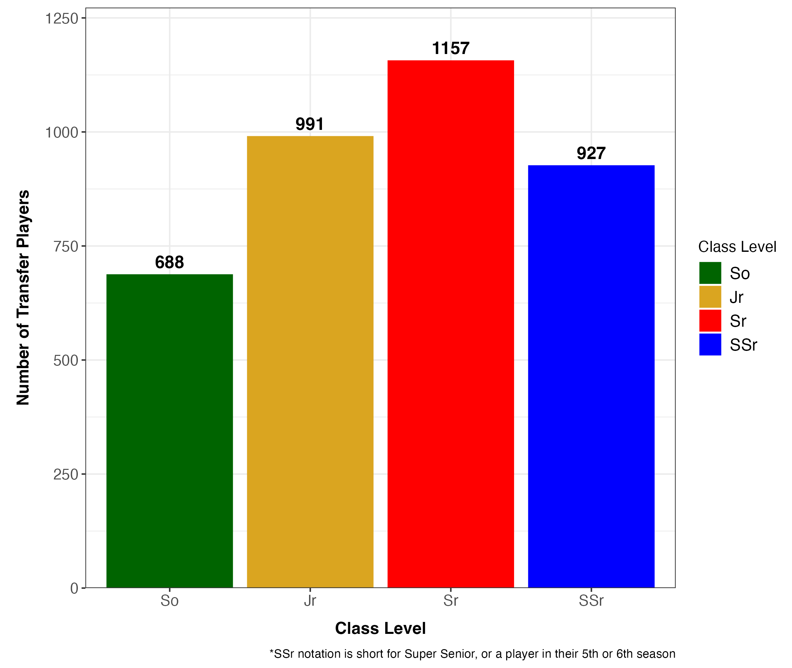{#fig-transfer-experience}

Similarly to the position graph, this bar chart informs on when players are transferring in their career. It is most common for players to transfer from their junior to senior year, making the year after the transfer occurs, or the first season at a new school, a player's senior year. Again, it is not known why this is, but knowing this information helps to analyze the patterns on transfer players as a whole.

**e) Conference with the most transfers**

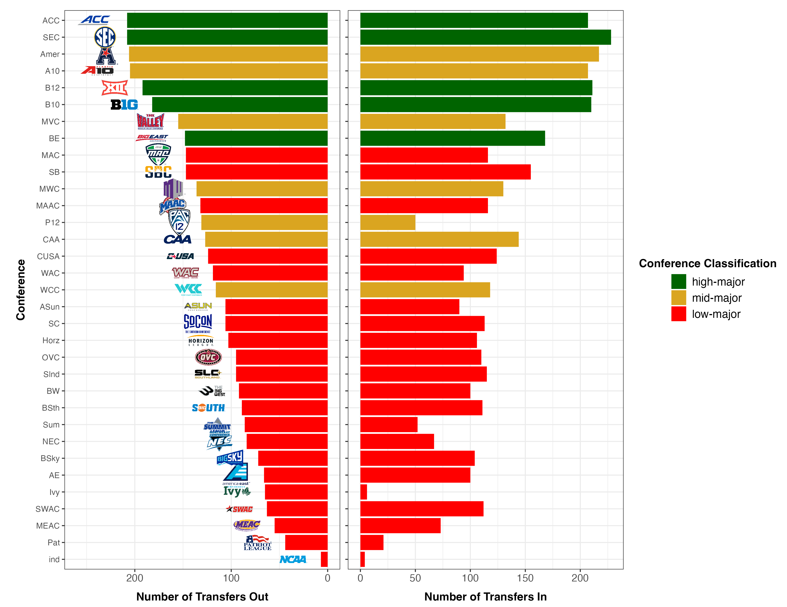{#fig-transfer-conference}

This chart displays which conferences have the most transfers in and the most transfers out. Sorted from transfers out highest to lowest, we can see how players are moving between conferences. A major insight that this displays is that many of the conferences with the most movement of transfer players are categorized as high and mid-major. This may be correlated with funding and the NIL money, as players are moving to where they gain the most financial incentive.

## Methods {#methods}

We estimated the effect of transferring on player performance using a mixed effects regression model following propensity score matching. More detailed information about the relevant variables and notations for modeling is outlined in [Appendix 1](#appendix-1), and the results that informed our model selection process is mentioned in detail in [Appendix 2](#appendix-2).

We also attempted to validate the findings of [Cole et al. (2026)](https://doi.org/10.51221/sc.jiia.2026.19.1.15) about the differential effects of transferring on player performance related to whether the player was overperforming or underperforming in their previous season at the NCAA Division I men's basketball. By changing the definition of the $\text{Transferred}$ variable to only include players who transferred as overperformers (above or equal to the median performance among all players in the team) and underperformers (below the median performance among all players in the team), we expected to see a more pronounced effect of transferring on player performance.

### 1. Propensity score matching

First, we performed propensity score matching using the MatchIt package in R [(Ho et al., 2011)](https://doi.org/10.18637/jss.v042.i08). As certain groups of players are more likely to transfer than others, the matching ruled out possibilities of a selection bias when making inferences about the effect of transferring on player performance.

The process involved matching a transferred player to $n$ non-transferred players without replacement. Here, $n$ is an integer representing the approximate ratio of the number of transfers to the number of non-transfers. Using our exploratory data analysis, $n$ equals $2$ if we considered all types of transfers, $7$ for overperformer transfers, and $4$ for underperformer transfers. Our flexible choice of the matching ratio allowed us to obtain a representative sample of NCAA players after the matching process.

We specified the following logistic regression model to determine the propensity scores associated with how likely each player is an incoming transfer for each player and year combination:

$$\widehat{\text{Transferred}_{ijkt}} = \beta_1 \text{Position}_i + \beta_2 \text{Experience}_{it} + \beta_3 \text{TeamRating}_{jt} + \beta_4 \text{ConfRating}_{kt}$$

Regarding the matching method, we used MatchIt's default nearest neighbor matching and set the caliper width to "$0.2$ the standard deviation of the logit of the propensity score" using the recommendation from [Austin (2011)](https://doi.org/10.1002/pst.433), which prevents players with vastly different statistics to be matched with each other. For the variable selection, we only included covariates that could affect a player's performance, but do not necessarily affect their choice of staying in the team or transferring. According to [Brookhart et al. (2006)](https://doi.org/10.1093/aje/kwj149), this choice of variables would improve the accuracy of our inferences because it would decrease the variance of our estimated effects of a transfer without increasing bias.

Before we proceeded to fitting a regression model on the matched data, we constructed Love plots to check for balance between the treatment group and control group, which is outlined in [Appendix 3](#appendix-3). In the matched data, all covariates had an absolute standardized mean difference of less than or equal to $0.1$, which implies that the treatment and control groups were similar and we had properly controlled for confounding variables related to players' choices to transfer.

### 2. Mixed effects regression model

After we controlled for selection biases in players' transfer decisions using propensity score matching, we fit a mixed effects regression model on the matched data to precisely determine the effect of transferring on player performance, controlling for more factors such as individual athletic ability and team context. Here, we quantified a player's performance by their points per game (PPG), since this metric is easily accessible and interpretable for non-statistical audiences.

The full equation for our mixed effects regression model is:

$$\widehat{\text{PPG}_{ijkt}} = a_{ij} + \beta_1 \text{Transferred}_{ij} + \beta_2 t + \beta_3 \text{PPG}_{i,t-1} + \beta_4 \text{Position}_{i} + \beta_5 \text{Experience}_{it} +\\ \beta_6 \text{Conference}_{kt} + \beta_7 \text{TeamRating}_{jt} + \beta_8 \text{ConfRating}_{kt} + \epsilon_{ijkt}$$

In this model, the coefficients numbered from $\beta_1$ to $\beta_8$, represents the fixed effects, and $\epsilon_{ijkt}$ represents the error term.

Using the model selection results from [Appendix 2](#appendix-2) and domain knowledge, we specify an intercept $a_{ij}$ specific to each player and team combination:

$$a_{ij} = \alpha_0 + u_{ij}, \quad \quad u_{ij} \sim N(0,\tau^2).$$

The coefficient $\beta_1$ for the $\text{Transferred}$ variable would give the magnitude of the effect of transferring on a player's points per game in the current year, while the standard error associated with that coefficient would determine the statistical significance of our estimates.

## Results {#results}

**a) In aggregate, what is the effects of transferring on the number of points per game that a player gets in an NCAA basketball season?**

```{r}
models_matching_summary <- readRDS("Le/saved/models_matching_summary.rds")
compare_causal_plot <- readRDS("Le/saved/compare_causal_plot.rds")
match_object_love_plot <- readRDS("Le/saved/match_object_love_plot.rds")
summary_in_aggregate <- readRDS("Le/saved/summary_in_aggregate.rds")
```

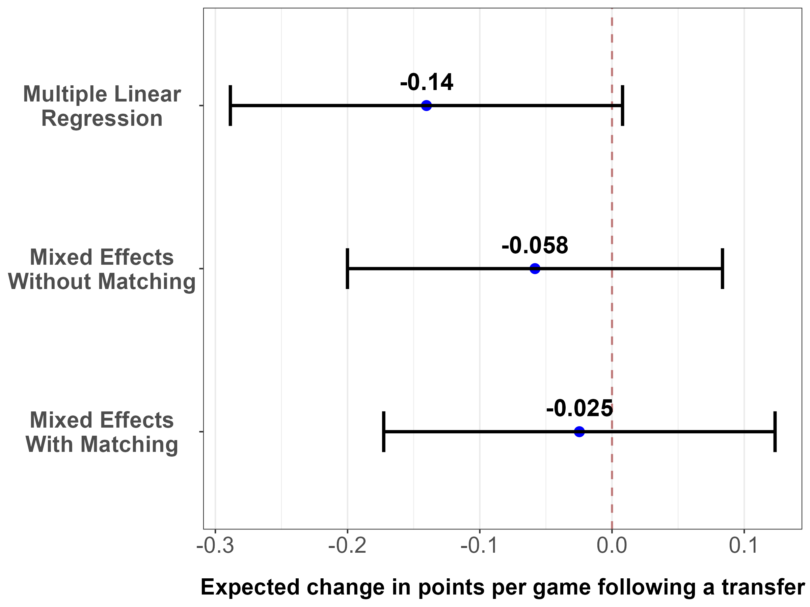{#fig-causal-plot-baseline width="70%"}

@fig-causal-plot-baseline shows the point estimates for the coefficient associated with the $Transferred$ variable using different regression models, along with the 95% confidence intervals in a visual form. For the mixed effects model following propensity score matching as outlined in the [Methods](#methods) section, on average, a transfer is associated with a 0.025 point decrease in the number of points per game for a college basketball player. The 95% confidence interval for the estimate contained $0$, which implies that the effect of a transfer on player performance is not statistically significant.

```{r}
#| label: tbl-summary-in-aggregate
#| tbl-cap: Effects of Transferring and Other Useful Factors on Player Performance, in Aggregate

summary_in_aggregate

# Cross-referencing tables using the modelsummary package:
# https://stackoverflow.com/questions/78829519/r-quarto-table-cross-reference-not-working-when-using-modelsummary
```

@tbl-summary-in-aggregate summarizes the results of the three regression models used in @fig-causal-plot-baseline in greater detail. In the table, models **(1)**, **(2)**, and **(3)** represents the multiple linear regression model (which only includes the fixed effects), mixed effects models without and with propensity score matching, in their respective order. We found that simpler models show a slightly negative bias in estimating the effect of a transfer compared to more complex models. However, the standard errors did not widely vary across the models, and given the magnitude and standard errors of the models' estimates, all three models gave the same conclusion that transfers, in aggregate, do not have a large nor significant impact on performance.

**b) Are the effects of transferring on a player's number of points per game related to whether a player transferred as an overperformer or an underperformer?**

The question is directly motivated by our goal to replicate the recent findings from a prior work by [Cole et al. (2026)](https://doi.org/10.51221/sc.jiia.2026.19.1.15). As mentioned in the [Methods](#methods) section, we defined overperformers as among the "top 50%" of players in a team and underperformers as among the remaining "bottom 50%", using the median points per game across all players in the same team as the threshold.

We repeated the modeling steps as outlined in the [Methods](#methods) section, comparing the results of the mixed effects model followed by propensity score matching when we changed the definition of the treatment group to only include players who transferred as underperformers and as overperformers in the previous season. The results are represented in tabular form with @tbl-models-matching-summary. Here, models **(1)**, **(2)**, and **(3)** denote mixed effects models with matching when we considered transfers on aggregate, underperformer transfers only, and overperformer transfers only, in their respective order.

```{r}
#| label: tbl-models-matching-summary
#| tbl-cap: Effects of Transferring and Other Useful Factors on Player Performance, Estimated by Mixed Effects with Matching Model

models_matching_summary
```

According to @tbl-models-matching-summary, on average, transferring as an underperformer is associated with an approximately 1.98 point increase in the athlete's points per game, while transferring as an overperformer is associated with an approximately 1.46 point decrease in the athlete's points per game. The effects of underperformer and overperformer transfers shown in the table are also statistically significant $(p < 0.001)$. For most college basketball athletes, these changes in points per game are meaningful and correspond well with a notable change in an athlete's presence and contribution on the court. The magnitude and significance of our estimates also validated the prior finding by [Cole et al. (2026)](https://doi.org/10.51221/sc.jiia.2026.19.1.15).

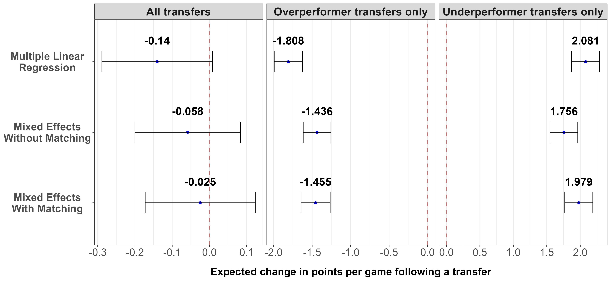{#fig-causal-plot-robust}

Using the same approach to analyzing the effects of transferring on an athlete's points per game in aggregate, we also compared our estimates using the mixed effects model following propensity score matching with less complex models. The results are represented in visual form with @fig-causal-plot-robust.

Compared to our mixed effects model with propensity score matching, the multiple linear regression model overestimated the magnitude of the effect of transferring on player performance, and the mixed effects without matching model underestimated the magnitude. Nevertheless, the direction of the effect, the point estimates, and the standard errors did not widely vary between the three models. Therefore, we have a reason to conclude that all three models still gave the same conclusion even when we only included overperformer transfers or underperformer transfers in the treatment group, and that the small and statistically insignificant effect of transferring on player performance in aggregate might be the result of "averaging out" the effects of underperformer and overperformer.

## Discussion

### 1. Implications and practical recommendations

This research provides multiple understandings on the relationship between a transferring and a player's athletic performance. When analyzing this relationship on all transfer athletes, an insignificant affect on a player's points per game after transferring was found in all 3 models. However, when it comes to grouping players into overperformers and underperformers based on their performance relative their teammates, the significant results lie in this distinction.

Firstly, the results of this study impact players in NCAA Division I Men's Basketball. A player, before transferring, may want to look into their performance relative to their team, and assess their status as either an underperformer or overperformer within their respective program. From here, underperformers will find more success transferring to a smaller or lesser ranked program, effectively scoring around 2 more points per game compared to a similar player that does not transfer. Reversely, as an overperformer at their current program, upon transferring, players experience a 1.5 point per game drop compared to players that do not transfer between years. So, overperformers may want to rethink the decision of transferring before fully committing to a different school.

From a coach's perspective, a similar framework can be applied on finding players from the portal to invest in. The more successful players after a transfer occurs, will come from underperformers at a higher ranked school. For example, a coach may attempt to find a replacement for a player already on the roster. If a replacement player comes from an underperforming background at a bigger program and has a similar propensity score to a player already on the roster, that replacement player would be projected to score 2 more points per game than the existing player. Conversely, it is expected that a transfer player coming as an overperformer at a smaller program will obtain around 1.5 points per game less than a similar player who stays. So, while scouting up and coming talent from lesser teams can give that player a new atmosphere, that choice in player might not always result in an improved performance.

A major takeaway from these findings is the importance of finding a competition level where the player can maximize their potential. Different conferences within the NCAA are like their own miniature leagues with their own competition level. This gives players the unique ability to find the niche environment to perform their best. Furthermore, transferring gives players the ability to do exactly this. Of course, with the always-changing makeup of the modern NCAA, the need for further analysis persists.

### 2. Limitations and next steps

**a) Data constraints**

Similar to the discussions by [Cole et al. (2026)](https://doi.org/10.51221/sc.jiia.2026.19.1.15), our data source did not provide an entirely clear way to understand certain players' transfer histories only via data wrangling. In addition, it did not contain many confounding variables that affected both a player's decision to transfer and their athletic performance, which could lead to omitted variable biases when specifying our regression models.

First, we found that although our data source offered information on players and their team in their respective seasons, transfers in the data for NCAA Division I player statistics are not entirely straightforward comparisons between a player's team in the current year and in the previous year. One of the most common cases that lead to such a complex transfer history is redshirting, where a player sit out an entire year either intentionally to prolong their eligibility status or as a result of some extenuating circumstances, such as injuries and academics. Other issues that complicated our process of obtaining information on transfers include college players self-selecting to turn professional before their eligibility clock ends (such as "one-and-done"), and players transferring outside NCAA Division I, likely to lower divisions or junior colleges (including the so-called "4-2-4 pathway"), to gain additional experience and visibility before returning to the NCAA Division I tournaments. In the long term, a more organized data collection process is needed to capture college athletes' case-by-case use of their eligibility window.

Second, our data only contained information on the players' actual on-court performance, such as points per game and percentage of available minutes played, along with their name, school (team), position, and year in college. In reality, collegiate athletes can transfer for a multitude of reasons well beyond the scope of our data, such as proximity to home, academic and culture fits, academics, injuries, or coaching changes. One especially prominent motivation behind many collegiate athletics transfers in the 2022-2026 period was revenue from Name, Image, and Likeness (NIL), in which players can choose to sacrifice their athletic performance in exchange for a more prestigious brand name and higher visibility. The true amount of NIL money that each NCAA Division I men's basketball athlete receives has not been publicly disclosed, which becomes a perennial confounding variable in collegiate athletics research.

**b) Model specifications**

First, for the outcome variable, we used points per game (PPG) as an easily accessible and interpretable measure of player performance. Despite their advantages, it should not be regarded as an all-in-one metric to quantify a player's efficiency on the court, since PPG can be biased towards high playing time as well as certain positions and team strategies. We want to explore more advanced metrics, such as points per possession (PPP), Regularized Adjusted Plus-Minus (RAPM), or Points Over Replacement Per Adjusted Game At That Usage (PORPAGATU!), to obtain a more holistic overview of player performance. Another promising solution would be to replace a player's raw performance metrics, such as PPG, with their corresponding league percentile, adjusted for position and/or experience level.

Second, when we examined the assumptions for our modeling through data visualizations in [Appendix 3](#appendix-3), we noticed that the matched data following the propensity score matching process displayed clear signs of heteroskedasticity. While this did not affect our estimated magnitude of the effects of transfers on player performance, it would affect the statistical significance of these estimates. We plan to address the issue in future versions of the project by replacing the current standard errors stated in the [Results](#results) section with the corresponding heteroskedasticity-robust standard errors.

Finally, we also plan to explore more flexible model specifications, such as Generalized Linear Models (GLMs) and Generalized Additive Models (GAMs) to better capture non-linear relationships between a player's characteristics and their decision to transfer or their athletic performance. For instance, in the mixed effects model, we propose experimenting with tweedie regression if PPG is used as the outcome variable, as PPG across the league is highly right-skewed and some players have zero PPG. We may also add player-specific random slopes to account for players' varying changes in athletic performance following a transfer, especially for personal, non-athletic factors beyond the scope of our data.

## Acknowledgements

We would like to give special thanks to:

-   **Professors Ron Yurko and Zach Branson** from Carnegie Mellon University, who had offered us great guidance on the methodology for propensity score matching and causal inference in sports applications,
-   **Katerina Wu and Lucca Ferraz** from the University of Pittsburgh Athletics, who provided invaluable feedback and domain knowledge,
-   **Sara Colando** and **Erin Franke**, the program instructors for their lectures,
-   **Princess Allotey**, **JungHo Lee**, and **Yuchen Chen**, the program's Teaching Assistants for their statistical expertise, their presence and willingness to help us in the daily labs.

## References

Austin, P. C. (2011). Optimal caliper widths for propensity‐score matching when estimating differences in means and differences in proportions in observational studies. *Pharmaceutical Statistics, 10*(2), 150–161. <https://doi.org/10.1002/pst.433>

Bates, D., Maechler, M., Bolker, B., Walker, S. (2015). Fitting Linear Mixed-Effects Models Using lme4. *Journal of Statistical Software, 67*(1), 1-48. <https://doi.org/10.18637/jss.v067.i01>

Brookhart, M. A., Schneeweiss, S., Rothman, K. J., Glynn, R. J., Avorn, J., & Stürmer, T. (2006). Variable selection for propensity score models. *American Journal of Epidemiology, 163*(12), 1149–1156. <https://doi.org/10.1093/aje/kwj149>

Cole, K., Pearman, F., & Khanna, S. (2026). Big Fish or Little Pond? National Evidence on the Relationship Between Transferring and Athletic Performance Within Division I Men's College Basketball. *Journal of Issues in Intercollegiate Athletics, 19*(1). <https://doi.org/10.51221/sc.jiia.2026.19.1.15>

Gilani, S. (2026). *hoopR: Access Men's Basketball Play by Play Data*. (Version 3.1.0) \[Computer software\]. <https://github.com/sportsdataverse/hoopR>

Ho, D., Imai, K., King, G., Stuart, E. (2011). MatchIt: Nonparametric Preprocessing for Parametric Causal Inference. *Journal of Statistical Software, 42*(8), 1-28. <https://doi.org/10.18637/jss.v042.i08>

National Collegiate Athletic Association. (n.d.). *Student-Athlete Transfer Research*. NCAA. Retrieved July 19, 2026, from <https://www.ncaa.org/what-we-do/research/student-athlete-transfer-research/>

Ward, P. (2025, April 1). *Crossed vs Nested Random Effects*. Optimum Sports Performance. Retrieved July 23, 2026, from <https://optimumsportsperformance.com/blog/crossed-vs-nested-random-effects/>

Yurko, R. (2025, September 27). *College Football Volatility: A Bayesian State-Space Model of the Transfer Portal and NIL Impact* \[Conference presentation\]. 2025 New England Symposium on Statistics in Sports, Cambridge, MA, United States. <https://www.youtube.com/watch?v=SdXpknMhGBc>

## Contact Information and Code Availability {#contact}

We are happy to receive feedback and answer questions related to our project via email:

-   **An Le** (Bates College): [thaianle1102\@gmail.com](mailto:thaianle1102@gmail.com)
-   **Kendall Lucas** (Duquesne University): [kendalllucas724\@gmail.com](mailto:kendalllucas724@gmail.com)

Our code is publicly available on a GitHub repository named [`ncaa-capstone-cmsacamp-2026`](https://github.com/thaianle/ncaa-capstone-cmsacamp-2026/tree/main).

## Appendix 1: Variable naming in equations {#appendix-1}

| Variable | Full name | Description and additional preprocessing |
|------------------------|------------------------|------------------------|
| $PPG$ | Points Per Game | **Numeric Variable:** The average number of points a player score in each game, or total points scored over the season divided by the total games played. |
| $Transferred$ | Is Incoming Transfer | **Binary Indicator Variable:** Indicates if the player is an incoming transfer. Transfer players are players who are new to a roster and came from a different school. 0 indicates the player is not an incoming transfer and 1 indicates the player is an incoming transfer. |
| $Position$ | Position | **Categorical Variable:** The groups of players that are best and used for a certain part of the game. We re-classified players into three broad categories: Guards, Forwards, and Centers, in place of the fine-grained position classification system by Bart Torvik.<br>Guards are often short and fast play-makers who excel in handling the ball and shooting. Forwards are more medium sized players who mainly play closer to the hoop but are also highly versatile. Lastly, Centers largest players who make short distance shots and block opponents shots. |
| $Experience$ | Experience Level or Class Year | **Numeric Variable:** Values are recoded from 1-5 instead of first years to super-seniors to reflect more of a number of seasons played framework. |
| $TeamRating$ | Team Rating | **Numeric Variable:** Barthag Rating Metric is a score a team receives from a 0 to 1 scale. Essentially, this gives the probability that this team will beat the average team in Division I. |
| $Conference$ | Conference | **Categorical Variable:** Conferences are groupings of schools with similar athletic funding budgets that play in a shared league. |
| $ConfRating$ | Conference Rating | **Numeric Variable:** The Average Barthag Metric of all the schools inside corresponding conference. Also on a scale from 0 to 1. |

: Descriptions for Relevant Variables for Modeling {#tbl-variable-descriptions tbl-colwidths="[20, 20, 60]"}

For the regression models outlined in the [Methods](#methods) section, $i$ represents an individual athlete, $j$ represents a team, $k$ represents a conference, and $t$ represents a season (denoted by the year in which the NCAA championship was played).

## Appendix 2: Model selection process for mixed effects regression {#appendix-2}

```{r}
models_fe_summary <- readRDS("Le/saved/models_fe_summary.rds")
models_mixed_summary <- readRDS("Le/saved/models_mixed_summary.rds")
```

As part of our initial modeling process, we experimented with both fixed effects and mixed effects regression models using different sets of covariates, and the results are reported in this appendix. These results were useful for us to decide the exact specifications for our main regression model to identify the estimated effect of transferring on a player's points per game.

```{r}
#| label: tbl-models-fe-summary
#| tbl-cap: Results of Different Fixed Effects Models with Points Per Game (PPG) as the Outcome Variable

models_fe_summary
```

First, we used fixed effects regression models to get a general overview of the effects of transfers and the player's natural development (colloquially called the "age curve") on player performance. @tbl-models-fe-summary shows the point estimates of important coefficients, along with the standard errors, of the following fixed effects models:

$$\widehat{\text{PPG}_{t}} = \beta_0 + \beta_1 \text{PPG}_{t-1} \tag{1}$$

$$\widehat{\text{PPG}_{i}} = \beta_0 + \beta_1 \text{Transferred}_{i} \tag{2}$$

$$\widehat{\text{PPG}_{ijkt}} = \beta_0 + \beta_1 \text{Transferred}_{ij} + \beta_2 t + \beta_3 \text{PPG}_{i,t-1} + \beta_4 \text{Position}_{i} +\\ \beta_5 \text{Experience}_{it} + \beta_6 \text{Conference}_{kt} + \beta_7 \text{TeamRating}_{jt} + \beta_8 \text{ConfRating}_{kt} \tag{3}$$

The results in models **(1)** and **(2)** in @tbl-models-fe-summary replicates the findings of the [Exploratory Data Analysis](#exploratory-data-analysis) section: both points per game in previous season and being an incoming transfer is positively correlated with player performance, as evidenced in the positive and considerable effect sizes. Unsurprisingly, the adjusted R<sup>2</sup> of model **(1)** (= 0.419) is higher than that of model **(2)** (= 0.010), suggesting that without any additional control variables, a player's points per game in their previous season in NCAA Division I men's basketball is much more predictive than whether they are an incoming transfer or not. Model **(3)** in the same table illustrates that the estimated effects of transferring on player performance can widely vary by including control variables, and thus a simple linear regression model would introduce a considerable amount of bias into our estimates.

Next, we compared the results of different mixed effects regression models, with a goal of determining which model is more valid to estimate the effect of transferring on player performance.

```{r}
#| label: tbl-models-mixed-summary
#| tbl-cap: Results of Different Mixed Effects Models with Different Random Effects Specifications

models_mixed_summary
```

@tbl-models-mixed-summary displays the coefficient estimates of the $Transferred$ variable and standard deviation of within-group variations for teams, players, and the team-player interactions. All three models in the table contains similar fixed effects, such as position, experience level, and conference; and their only differences are in the random effects. To avoid fitting computationally expensive models on our dataset with thousands of observations, we only considered random intercepts in this case.

In @tbl-models-mixed-summary, model **(1)** specifies crossed random effects for players and teams (lme4 syntax: `1|team + 1|id`), model **(2)** specifies nested random effects (`1|team/id`), and model **(3)** specifies a partially crossed and nested random effects (`1|team + 1|id + 1|team:id`). We hypothesized that the partially crossed and nested random effects model would capture the most random variations between players' and teams' baseline performance. This hypothesis was justified by a clearly illustrated example from [Ward (2025)](https://optimumsportsperformance.com/blog/crossed-vs-nested-random-effects/): an athlete can play for more than one team, but one single athlete can never play for all teams specified in the dataset.

The only remarkable differences between the results of three models outlined in @tbl-models-mixed-summary concern the standard deviations corresponding to within-player, within-team, and within-player-and-team variations. The within-player and within-team variations on their own was approximately zero for our data, but the standard deviation for the interacted variation across all player-team combination as shown in model **(3)** was notable.

As a final validation, we tested if adding the random intercepts for player-team interaction (`1|team:id`) to extend model **(3)** of @tbl-models-fe-summary (the most complex regression model that only included fixed effects) is actually necessary. Results from the likelihood ratio test (LRT) strongly supports the decision to factor an interacted random intercept for each player and team combination ($\chi^2(1) = 308.42, p < 0.001$).

## Appendix 3: Visual diagnostics of the models {#appendix-3}

**a) Balance diagnostics for the propensity score matching model**

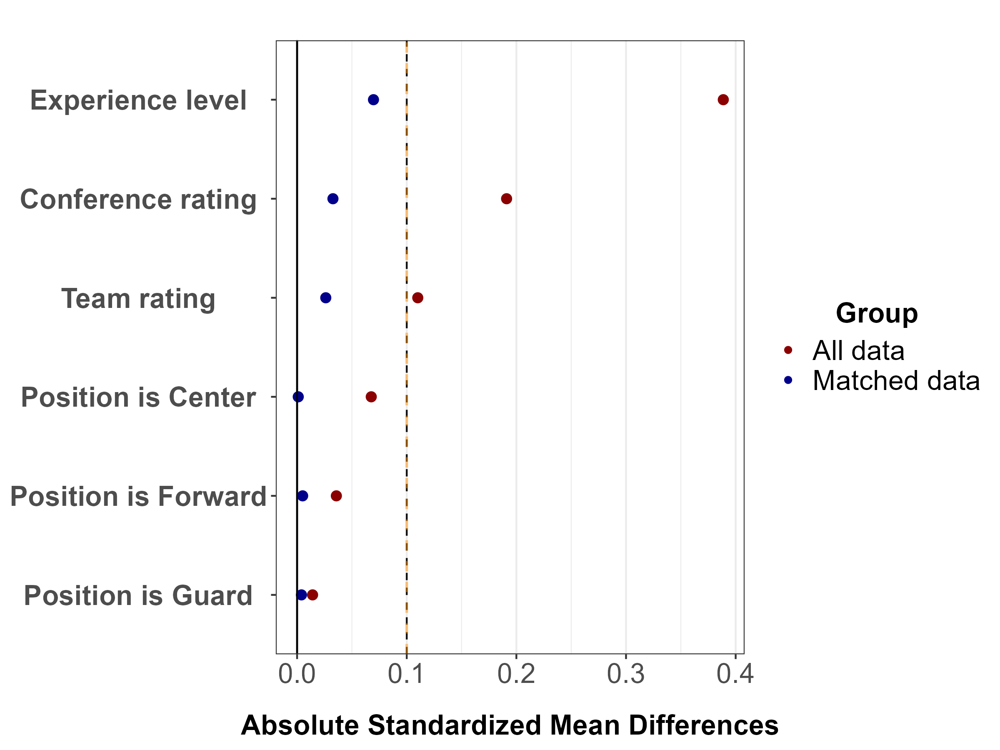{#fig-love-plot-all width="70%"}

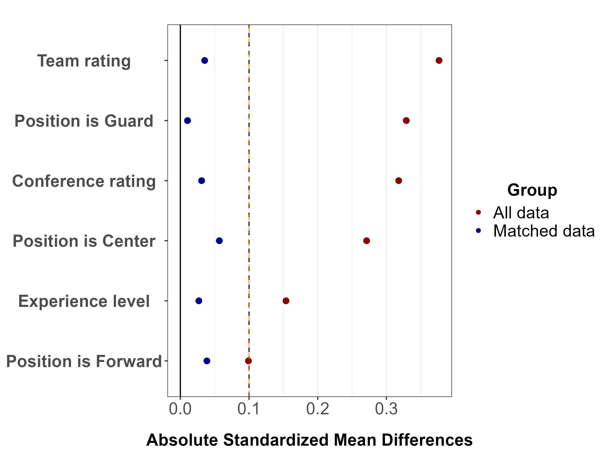{#fig-love-plot-underperf width="70%"}

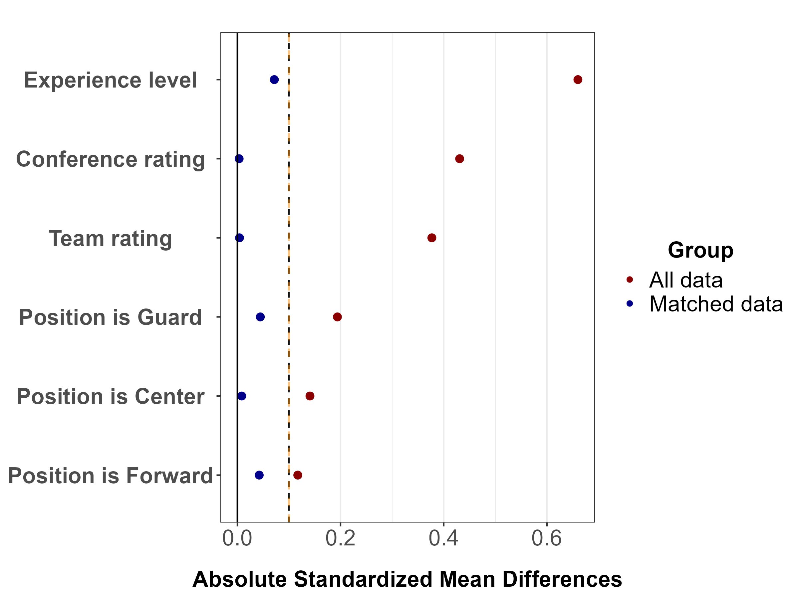{#fig-love-plot-overperf width="70%"}

**b) Residuals versus fits plot for mixed effects regression models**

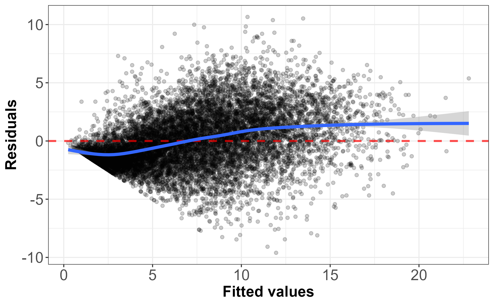{#fig-fitted-vs-resid-normal width="70%"}

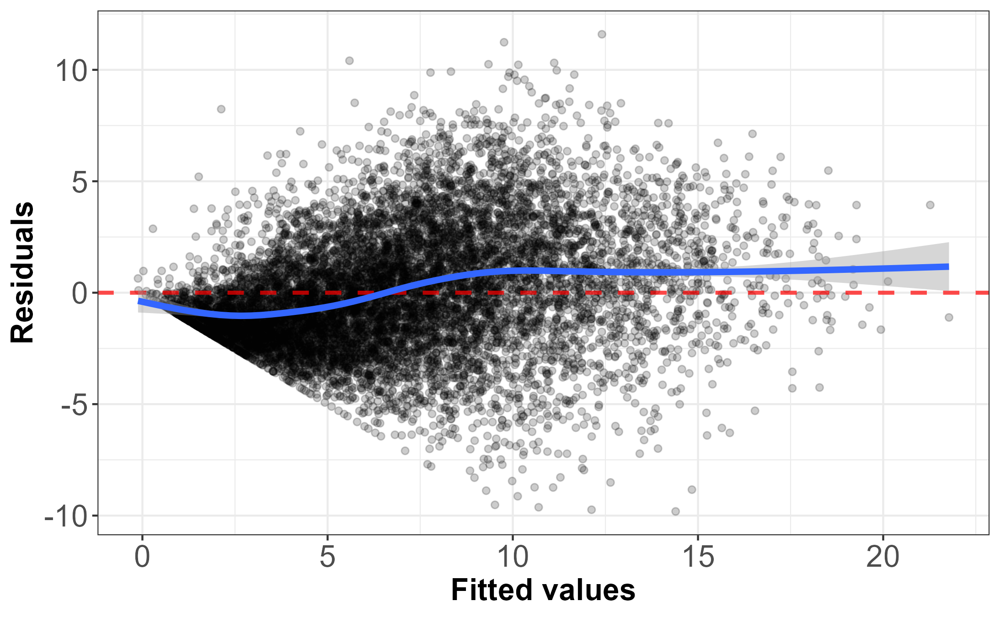{#fig-fitted-vs-resid-underperf width="70%"}

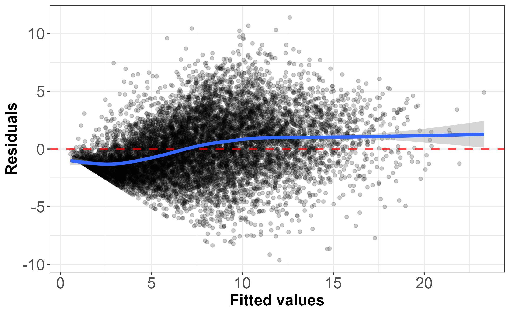{#fig-fitted-vs-resid-overperf width="70%"}
