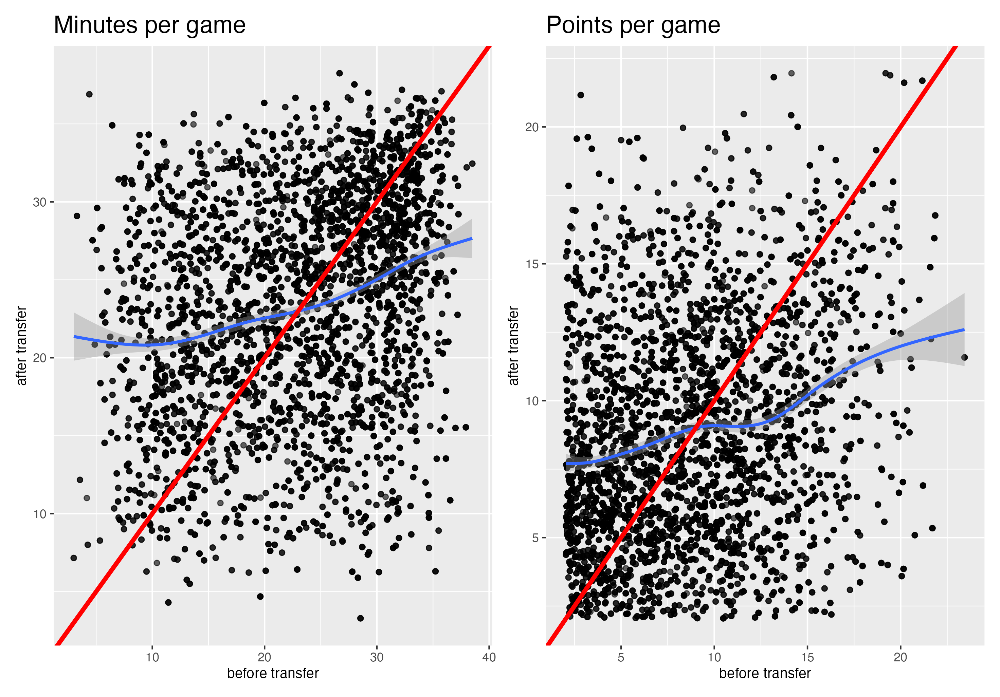

------------------------------------------------------------------------

## Introduction

College Athletics in America is a multi-billion-dollar enterprise and is a crucial step in developing elite athletes. Mainly governed by the National Collegiate Athletics Association (NCAA), college sports not only generates revenue, but acts as a pathway for future Olympians, professional, and world-class athletes. Because of the NCAAs global impact on athletics, looking at the rules and trends in this part of sports can provide information on what helps athletes become the most successful in their sport. An enormous part of the NCAA is for a player's ability to transfer, or when the player decides to change what institution they attend and play for. This concept is not seen in many professional levels, and allows for the player to find the best fit academically, athletically, or personally. But just like transferring impacts players individually, it also affects teams and coaches. Furthermore, a team utilizing the transfer portal, an online database where athletes declare their intent to leave, may gain a leg-up for that following season by filling performance holes in their previous roster with new talent. The effects of transferring could be endless, and a major question is what are the effects of transferring on a players performance?

## Data

When it comes to the data used in our research, we used multiple sources. All of these sources are structured similarly; each observation is a player's season and their metrics for that season. For the first data source, we used data from the cbbdata R package to do some exploratory data analysis (EDA) to find overall trends and patterns. However, upon further research, it was determined that the hoopR package had more up-to-date data on player metrics and transfer status. After exploring this data a little more, the last dataset was given by an external advisor. This data is proprietary and not available to the public. Regarding adding new features, similar columns were created dispite the use of three different data sources. This was mainly because comparing metrics between transfers and non-transfers and also comparing transfer athletes the year before and year after their transfer. So, columns indicating a if the player is a transfer for a certain year, if they have transferred before, and how many times they have transferred were added for insight on a player's career path. Along with this, features on a player's previous years metrics were used to see a difference in player's performance between years. EDA that was completed to analyze the patterns used both categories of the new features created.

#### EDA 1: If a player is already performing well, they should not transfer

 \

#### EDA 2: Average points per game generally improves over players’ careers, but transfers typically outperform non-transfers

put image here

## Methods

